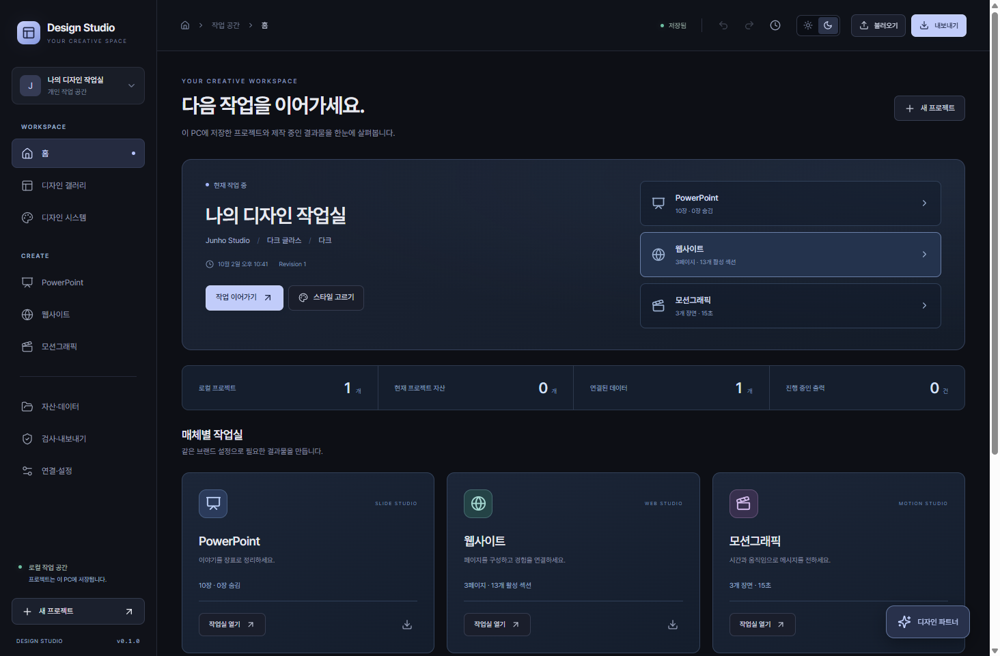

# Design Studio 0.1.0

Windows에서 브랜드와 스타일을 공유하며 PowerPoint, 웹사이트, 모션을 만드는 로컬 제작 앱입니다. 원본 `design-kit-v2`, `design-kit-v3`를 수정하지 않고 독립된 앱으로 구현했습니다.

현재 버전은 실행·편집·저장·실제 파일 출력을 제공하는 **초기 구현**입니다. 전체 장기 계획의 모든 기능을 제품 수준으로 완료한 버전은 아닙니다. 실제 지원 범위와 미구현 사항은 `IMPLEMENTATION_STATUS.md`에 구분했습니다.



## 바로 실행

[Windows LOCAL 다운로드](https://github.com/junthropic/My-Design-Studio/releases/latest/download/Design-Studio-Windows-x64-LOCAL.zip) · [최신 릴리스와 검증 결과](https://github.com/junthropic/My-Design-Studio/releases/latest) · [소스 ZIP](https://github.com/junthropic/My-Design-Studio/releases/latest/download/Design-Studio-source.zip)

ZIP 전체를 풀고 `win-unpacked/Design Studio.exe`를 실행합니다. 설치 프로그램과 개발용 Node/npm은 필요하지 않습니다. 현재 LOCAL EXE는 실제 UI·저장·9종 출력·종료·재실행·이력 복원과 전후 무결성 검증을 통과했습니다. 실행 파일과 필요한 런타임을 함께 제공하며 공개 코드 서명은 적용하지 않았습니다.

과거 오류 4551은 Smart App Control의 `VerifiedAndReputableDesktop` 정책에 의한 차단으로 확인됐습니다. 이후 LOCAL 최종 검증 시 읽기 전용으로 확인한 SAC 상태는 OFF였으며, 프로그램이나 작업 스크립트에서 Windows 보안 정책을 변경하지 않았습니다. 다른 PC의 SAC가 ON이면 미서명 LOCAL 실행이 차단될 수 있으며, 이를 빌드 오류와 구분해 보고합니다.

추가 진단에서 Smart App Control의 `VerifiedAndReputableDesktop` 정책과 미서명 상태가 확인됐습니다. `npm run signing:prepare`는 대상 manifest·mock 통합 검사 후 자격이 없으면 production 이전에 중단합니다. 자격 제공 후에는 `npm run signing:release`로 Azure Artifact Signing 또는 RSA OV 서명 → 최종 EXE 검증을 연결합니다. 기존 유효 vendor 서명은 보존하며 새 서명은 RSA·SHA256·RFC3161과 Authenticode/SignTool 이중 검사를 요구합니다. [서명 설정과 검증 범위](scripts/SIGNING.md)를 참고하세요.

- 최신 실행 파일은 위 GitHub Release의 LOCAL portable ZIP입니다. 과거 미검증 설치 프로그램을 최신 다운로드로 사용하지 않습니다.
- `win-unpacked` 폴더 전체가 필요합니다. EXE 하나만 옮기지 마세요.
- Node, npm, FFmpeg, 시스템 Chrome 설치 없이 핵심 편집과 출력이 동작하도록 Electron·영상 렌더 브라우저·인코더·Pretendard를 포함했습니다.
- 빌드·검증 방법은 [LOCAL 사용법](scripts/LOCAL.md), 업데이트·커밋·다운로드 갱신 방법은 [릴리스 절차](docs/RELEASING.md)를 참고하세요.

## 첫 작업

1. 홈에서 프로젝트를 만들고 디자인 시스템에서 브랜드명·원색·로고·글꼴을 설정합니다.
2. 갤러리에서 스타일을 선택합니다. 비교에 2~4개를 추가하면 같은 콘텐츠를 비교합니다. 적용해도 브랜드 원색은 유지됩니다.
3. 상단 **앱**에서 전체 화면의 라이트/다크를, **작업물**에서 작품의 라이트/다크를 각각 선택합니다. 앱 테마는 PC 설정에 저장되며 프로젝트 토큰·미리보기·출력물은 변경하지 않습니다.
4. PowerPoint에서 장표·텍스트·도형·이미지·표·차트를 편집합니다. Shift+선택으로 다중 선택하며 드래그 한 번이 되돌리기 한 번입니다.
5. 웹사이트에서 페이지·섹션·콘텐츠·열 수·데이터를 바꾸고 390/768/1280/1440 CSS px에서 확인합니다.
6. 모션에서 장면·레이어·효과·키프레임·오디오·자막을 편집하고 출력합니다.
7. 검사·내보내기에서 결과 파일과 변환 보고서를 함께 받습니다. `수동 확인`은 자동 검사를 통과했다는 뜻이 아닙니다.

기본 프로젝트에는 예제 콘텐츠가 들어갑니다. 예제 수치·사례·문구를 실제 작업 내용으로 교체하세요.

## 저장과 이동

- 왼쪽 상단 **프로젝트 선택** 메뉴의 연필·복제·휴지통 버튼으로 이름 변경·복제·삭제를 합니다. 복제는 최신 편집 내용을 먼저 저장하고 자산·데이터를 포함합니다. 삭제는 확인 창을 거치며 변경 이력도 삭제합니다. 진행 중인 출력/생성이 있으면 삭제가 거부됩니다.
- 마지막 프로젝트를 삭제하면 빈 작업 공간에 기본 새 프로젝트를 만듭니다. 공유 자산과 이미 생성한 출력 파일은 삭제하지 않습니다. 삭제 전 백업이 필요하면 프로젝트 패키지를 내보내세요.
- 편집은 잠시 입력을 멈추면 자동 저장합니다. `Ctrl+S`로 즉시 저장합니다.
- `Ctrl+Z`/`Ctrl+Shift+Z`: 앱 편집 되돌리기/다시 실행. 글자를 입력 중일 때는 입력 필드의 기본 동작을 따릅니다.
- 최근 200개 편집은 실행 중 메모리에 유지하고, 저장된 최근 50개 버전은 변경 이력에서 복원할 수 있습니다.
- 기본 저장 위치는 Electron 사용자 데이터 폴더의 `studio`입니다. Windows에서는 보통 `%APPDATA%/design-studio/studio`입니다. 설치 폴더와 별개입니다.
- 이동·백업은 검사·내보내기 → **프로젝트 패키지**를 사용합니다. `.designstudio` 안에 편집 원본과 자산·데이터 스냅샷이 들어갑니다. 새 PC에서는 불러오기를 사용합니다.
- 프로젝트 패키지는 API 키, 인증 헤더, 실시간 API 연결 설정을 포함하지 않습니다. 다른 PC에서는 연결을 다시 설정합니다.
- 프로젝트 이동 형식의 한도는 압축 파일 100MB, 압축 해제 합계 500MB, 자산당 100MB, 폴더 포함 2,000항목, 프로젝트 JSON 20MB입니다. 다시 불러올 수 없는 크기의 패키지는 내보내지 않고 원인을 표시합니다. 큰 영상은 압축하거나 프로젝트를 나누세요.
- 전체 DB를 복사할 때는 앱을 먼저 종료하고 데이터 폴더 전체를 보관합니다. OS로 암호화한 키는 다른 Windows 사용자에게 그대로 이전되지 않습니다.
- 렌더 중 앱이 종료되면 그 작업은 이력에 중단으로 남습니다. 다시 내보내면 새 작업·새 결과 파일을 생성합니다.
- PowerPoint 등 외부 앱에서 수정한 결과물은 별도 파일입니다. 스튜디오가 임의로 덮어쓰거나 역변환하지 않습니다.

## 매체별 사용

### PowerPoint

12종 레이아웃, 장표 추가·복제·순서·숨김·노트, 요소 위치·크기·색·회전·투명도·그룹 선택·레이어 순서를 지원합니다. 기본 좌표는 960×540 pt이며 16:9/4:3 전환을 제공합니다.

PPTX의 텍스트·기본 도형·표·표준 차트는 편집 가능한 개체입니다. 복잡한 유리·광원은 현재 평면 표현으로 근사하며, 효과가 완전히 동일하지 않은 항목은 보고서에 표시합니다. 웹/영상 효과가 PPT 애니메이션으로 자동 변환되지는 않습니다. 실제 PowerPoint 컴퓨터에 브랜드 글꼴이 필요합니다.

### 웹사이트

포트폴리오·랜딩·데이터 대시보드 페이지, 섹션 조립, 모바일 열 수, 이미지, 메타 제목/설명, 검색·정렬·상세·FAQ를 지원합니다. 웹 패키지에는 독립 정적 사이트와 React/TypeScript 소스 예제가 들어갑니다. 정적 사이트는 앱이 꺼져도 실행됩니다.

CSV/XLSX/JSON 또는 공개 HTTPS GET API에서 데이터를 가져옵니다. XLSX는 시트와 범위를 선택하고, 선택 범위 첫 행이 열 이름입니다. 공식 계산 엔진으로 수식을 다시 계산하지 않으므로 Excel에 저장된 값이 필요합니다. 백분율은 `0.15 → 15%`, 통화는 현재 KRW입니다. 앞자리 0이 있는 식별자는 문자열로 유지하세요.

현재 웹 출력은 데이터 **스냅샷**이 기본입니다. 인증 API를 사용한 프로젝트에는 서버 연결을 위한 Node 프록시 뼈대가 함께 나오지만, 실시간 갱신과 배포 연결은 별도 개발 단계입니다. 문의는 설정된 링크로 이동하며 전송되지 않은 문의를 성공으로 표시하지 않습니다.

### 모션

6개 장면 템플릿, 24개 효과, 장면·레이어 편집, 프레임 이동, x/y/투명도/회전/배율/색 키프레임과 SRT 자막을 제공합니다. 효과의 길이·강도·방향·지연·이징, 오디오 원본 구간과 페이드 인/아웃을 조절할 수 있습니다. 프리뷰와 출력은 같은 Remotion 컴포넌트와 프레임 계산을 사용합니다.

- MP4: H.264, 오디오가 있으면 AAC.
- WebM: VP8, 투명 배경 선택 가능.
- PNG 시퀀스: ZIP. 오디오 포함 안 함.
- 기본 가로/세로/정사각 1080p, 24/30/60fps 설정.

해상도·화면비 변경은 좌표와 크기를 맞추는 동작입니다. 자동 아트디렉션이나 완전한 레이아웃 재구성은 아닙니다. 세로 작업은 결과를 보고 요소 위치를 조정하세요.

## 외부 서비스

연결·설정에서 자신의 OpenAI/Anthropic/Gemini 키와 사용 가능한 모델 ID를 넣습니다. AI 제안은 요약과 허용된 변경 명령으로 받으며, 사용자가 선택 적용합니다. 현재 AI는 브랜드·토큰·기존 텍스트 변경을 지원합니다. 새 문서 전체 자동 생성은 후속 범위입니다.

Higgsfield는 모델 엔드포인트와 입력 JSON으로 견적을 조회한 뒤 사용자가 생성 버튼을 눌러야 요청합니다. 일일 한도는 **이 앱의 견적 예약액**이며 계정 전체 실제 청구액이 아닙니다. 접수 결과가 불명확하면 이력에서 같은 요청·키로 재확인합니다. 작업을 임의로 새 키로 반복 제출하지 않습니다.

Blender MCP는 별도로 설치·실행한 Blender와 호환 애드온·`uvx`가 필요합니다. 앱에서는 제한된 장면 조회·정해진 오브젝트 작업만 허용합니다. 임의 Python 실행 입력은 노출하지 않습니다.

After Effects/Blender 패키지는 JSON·자산·JSX/Python을 전달합니다. 해당 프로그램에서 스크립트를 실행한 뒤 `.aep`/`.blend`를 저장합니다. 프로그램 설치·실제 실행 전에는 해당 네이티브 파일 생성 완료로 표시하지 않습니다. 전달되지 않는 효과·차트·키프레임은 보고서를 확인하세요.

Blender 패키지는 오디오·자막 레이어를 생성하지 않습니다. 두 외부 어댑터의 효과 매개변수와 오디오 트림·페이드는 대상 프로그램에서 다시 설정해야 합니다.

개발 중 실제 유료 서비스 호출은 하지 않았습니다. 키 연결·모델 권한·제공자 결과는 사용자 계정에서 별도 확인해야 합니다.

## 개발

```powershell
npm ci
npm run build
npm run desktop
```

브라우저 개발: `npm run dev`로 API를 실행하고 다른 통합 터미널에서 `npm run ui:dev`. 또는 빌드 후 `npm start`로 로컬 4318 포트에 접속합니다. 두 서버를 같은 데이터 폴더에 동시에 실행하지 않습니다.

```powershell
npm test
npm run format:check
npm run package:win
```

패키징은 최초 실행 시 공식 렌더 브라우저를 내려받습니다. 소스 실행은 Node 22 이상과 인터넷 의존성 설치가 필요하지만, 생성된 Windows 설치본은 시스템 Node를 요구하지 않습니다. `package-lock.json`으로 실제 설치 버전을 고정합니다.

| 경로              | 역할                                           |
| ----------------- | ---------------------------------------------- |
| `src/core/`       | 문서 타입·Zod 스키마·토큰 해석·기존 v2/v3 변환 |
| `src/components/` | 홈·갤러리·디자인·슬라이드·웹·자산·검사·설정 UI |
| `src/motion/`     | 결정적 효과 계산·타임라인·프레임 구성·인코딩   |
| `src/exporters/`  | PPTX·웹·DTCG·프로젝트·AE/Blender 어댑터        |
| `server/`         | 로컬 API·SQLite·비밀키·데이터·작업 큐·연동     |
| `electron/`       | 격리된 데스크톱 창과 로컬 서비스 수명 관리     |
| `tests/`          | 코어·서버·출력·영상 회귀 검사                  |

## 참고와 사용 조건

Pretendard는 동봉한 `public/fonts/OFL.txt`의 SIL OFL에 따릅니다. Remotion은 사용 형태에 맞는 [라이선스](https://www.remotion.dev/docs/license/pricing)를 확인해야 합니다. 다른 사용자의 자산·글꼴을 배포할 때는 각각의 사용권을 확인하세요.

구현 참고: [DTCG](https://www.designtokens.org/tr/2025.10/format/), [PptxGenJS](https://gitbrent.github.io/PptxGenJS/docs/), [Remotion 렌더러](https://www.remotion.dev/docs/renderer/render-media), [Electron 보안](https://www.electronjs.org/docs/latest/tutorial/security), [Higgsfield 중복 방지](https://docs.higgsfield.ai/docs/concepts/idempotency).
