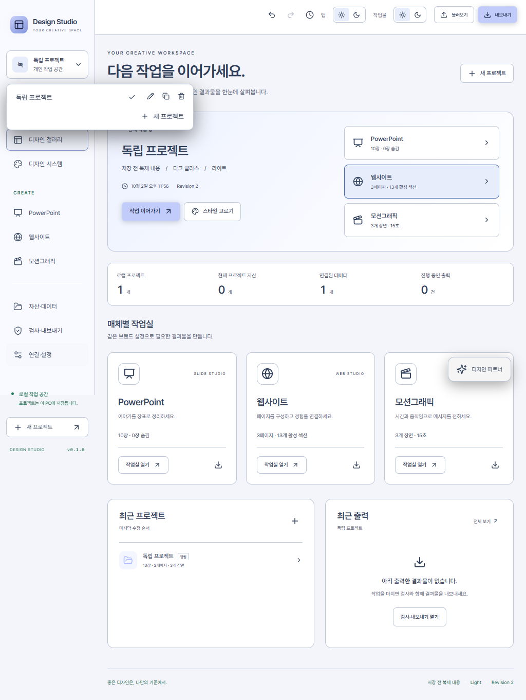

# 프로젝트 관리·앱 테마 패치와 기능 점검

브라우저 통합 시험에서 확인한 프로젝트 메뉴와 라이트 모드:

## 이번 패치

| 항목 | 적용 내용 |
| --- | --- |
| 프로젝트 관리 | 선택 메뉴의 복제·삭제·이름 변경, 전체 이름 접근성 레이블, 긴 목록 스크롤·이름 말줄임 |
| 복제 | 먼저 저장을 완료하고 모든 문서·스타일·자산·데이터를 새 프로젝트 ID로 복제. 자산 파일은 콘텐츠 해시로 공유하고 편집 내용과 이력은 독립 |
| 삭제 | 확인·취소·오류 표시, 버전 충돌 및 실행 중 작업 차단. 마지막 프로젝트 삭제 후 기본 프로젝트 생성 |
| 앱 전체 테마 | 상단 '앱'과 '작업물' 조작 구분. 사이드바·배경·패널·모달·입력·모션 속성/타임라인의 라이트·다크. 재실행 후 PC 설정 유지 |
| 작업물 독립성 | 앱 테마 변경으로 프로젝트 데이터·리비전·토큰·작품 미리보기 색을 변경하지 않음 |
| 저장 경쟁 처리 | 저장 중 발생한 추가 변경까지 저장한 뒤 복제·전환·출력 진행 |
| 전환 상태 | 프로젝트 전환 시 이전 문서의 선택·편집 패널 상태 초기화. 이전 프로젝트의 지연된 AI/자산 응답이 현재 작업실을 다시 전환하지 못하도록 제한 |
| 생성 중복 방지 | 새 프로젝트 만들기 연속 클릭/Enter 중복 요청 방지, 이름 공백 정리·200자 제한 |
| 검사 순서 | LOCAL 릴리스의 UI 빌드를 모든 브라우저 테스트 앞에 배치해 이전 dist 또는 빈 폴더 검사 방지 |

삭제는 휴지통 이동이 아니라 프로젝트와 편집 이력의 삭제다. 공유 자산 파일과 기존 출력은 보존한다. 전체 디스크 정리 기능은 별도로 구현해야 한다.

## 점검 및 재현 범위

- `tests/project-management.test.ts`: 자산을 포함한 복제, 복제본의 독립 변경, 원본 삭제 후 자산 조회, 버전 충돌, 진행 작업 중 삭제 방지, 마지막 프로젝트 대체, 서버 재시작 후 앱 테마 보존.
- `tests/workspace-ui.test.ts`: 실제 화면에서 미저장 편집 복제·이름 변경·삭제 취소·비활성 프로젝트/마지막 프로젝트 삭제. 라이트/다크 각각 9개 메뉴의 접근성 검사. 미리보기의 실제 계산 색과 프로젝트 데이터 불변성, 재로드, 1024px 메뉴 확인.
- 기존 핵심·데이터·SVG·프로젝트 교환·PPT·웹·모션·저장·갤러리 검사 및 Production 122개 회귀 시험 유지.
- `publish:local`: 동일 소스의 최종 EXE 실행, 9종 출력, 종료·재시작·이력 복원, 배포 파일 무결성, GitHub 업로드 SHA256 검사. 매 릴리스의 결과는 `verification.json`에서 확인.

자동 접근성 검사는 검사한 화면에서의 결과이며 모든 콘텐츠·모든 키보드 시나리오의 WCAG 준수 인증은 아니다. 실제 유료 AI 호출 및 사용자의 Adobe/Blender 작업은 이번 점검에서 수행하지 않는다.

## 남은 기능과 우선순위

| 우선순위 | 남은 기능 | 현재 가능한 것 / 다음 작업 |
| --- | --- | --- |
| 높음 | 자동 백업·휴지통·복구 관리 | 수동 `.designstudio` 백업과 저장 버전 복원 제공. 삭제 취소 기간·백업 보관 주기·복구 UI 추가 필요 |
| 높음 | 마지막으로 열었던 프로젝트·편집 위치 복원 | 현재 시작 화면은 최근 수정 프로젝트 기준. 최근 활성 프로젝트/장표/페이지/프레임 별도 저장 필요 |
| 높음 | 실제 외부 계정·도구 통합 검증 | AI/Higgsfield 모의 계약과 전달 패키지는 검사. 실제 자격·모델 권한·AE/Blender 설치 환경에서 결과 회수 검증 필요 |
| 중간 | API 실시간 갱신·페이지네이션 | 현재 파일/API 데이터 스냅샷 중심. 연결 상태·갱신 주기·실패 재시도·최종 웹 실시간 연결 추가 필요 |
| 중간 | 전문 PPT·웹·모션 편집 | PPT 마스터/분배·웹 중첩 레이아웃/폭별 설정·모션 다중 오디오/파형/마스크/곡선 편집은 장기 계획에 남음 |
| 중간 | 업데이트 확인·자동 설치 | GitHub latest 다운로드는 새 릴리스로 갱신. 앱 내부 버전 확인·업데이트 알림·자동 교체는 아직 없음 |
| 중간 | 대용량 프로젝트 운영 | 공유 자산 정리, 대규모 목록 가상화, 전체 DB 백업, 디스크 부족·강제 종료 스트레스 검증 필요 |
| 배포 전 | Production 서명·다른 PC 설치 | 현재 미서명 LOCAL. 실제 자격이 있는 Production 서명과 다른 Windows 계정/PC의 설치·실행 검증 필요 |

전체 장기 계획을 완성했다고 표시하지 않는다. 세부 매체별 차이는 `IMPLEMENTATION_STATUS.md`를 유지한다.
